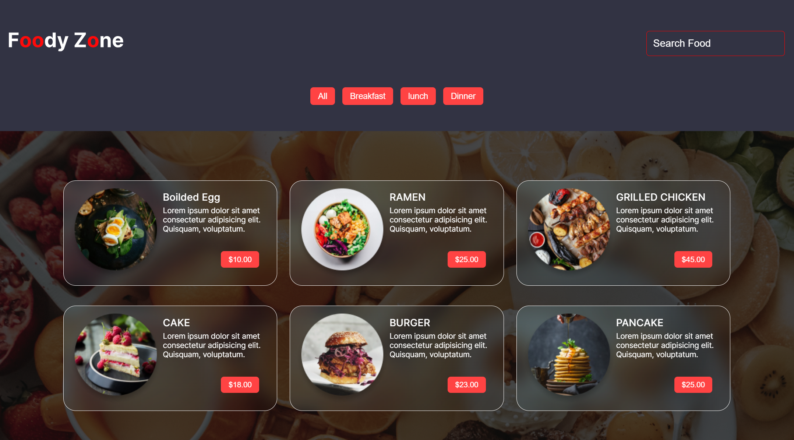

# Foody Zone React App
Foody Zone is a web application built with React that allows users to browse and search for various food items. The app fetches data from a local server, which is also created for this project, and provides users with search and filter functionalities to find their favorite food items. The app is fully responsive, making it accessible and enjoyable on different devices.

